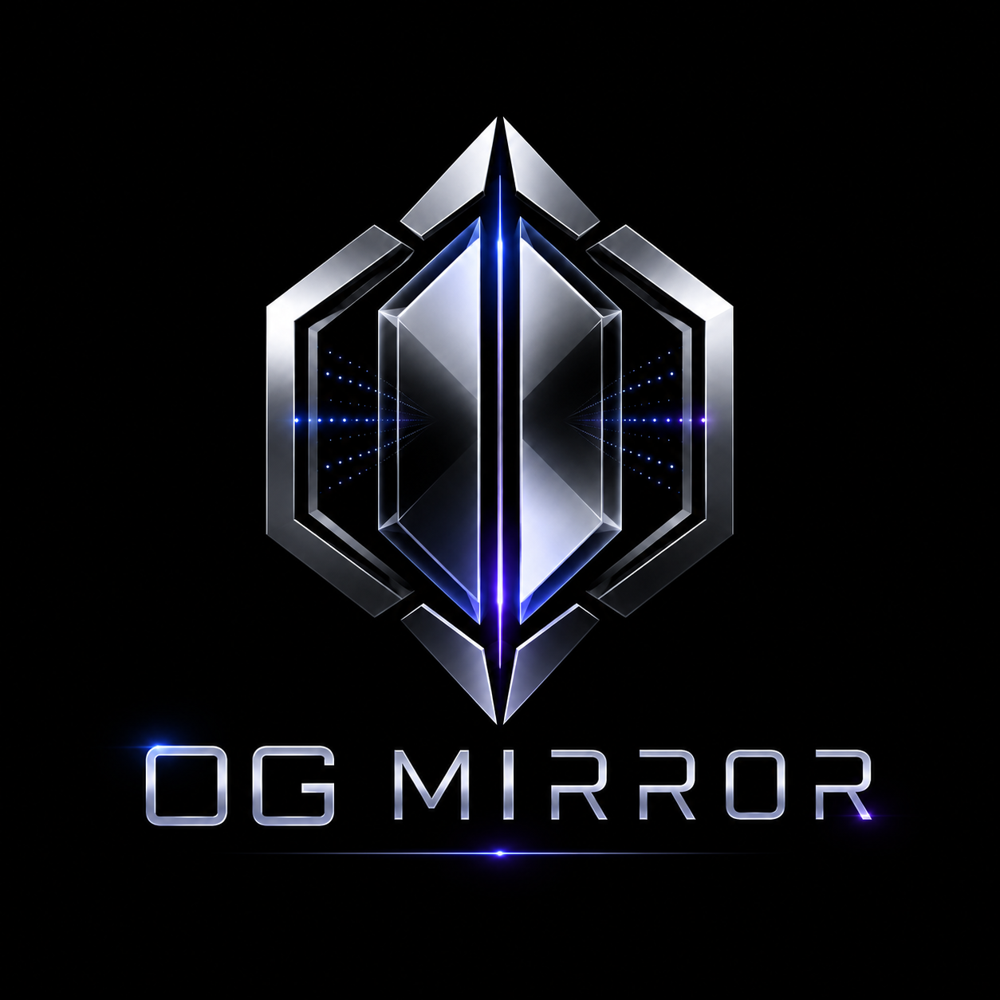
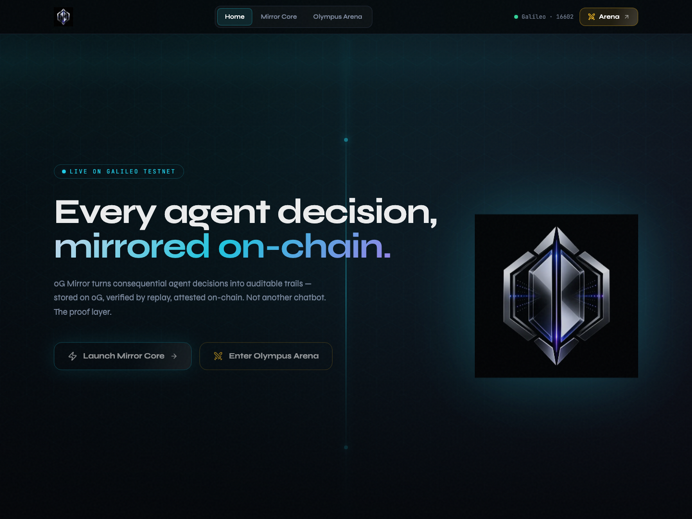
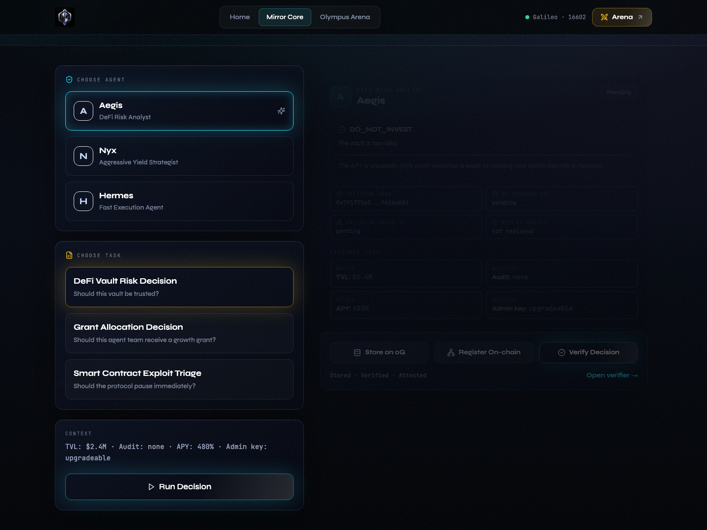
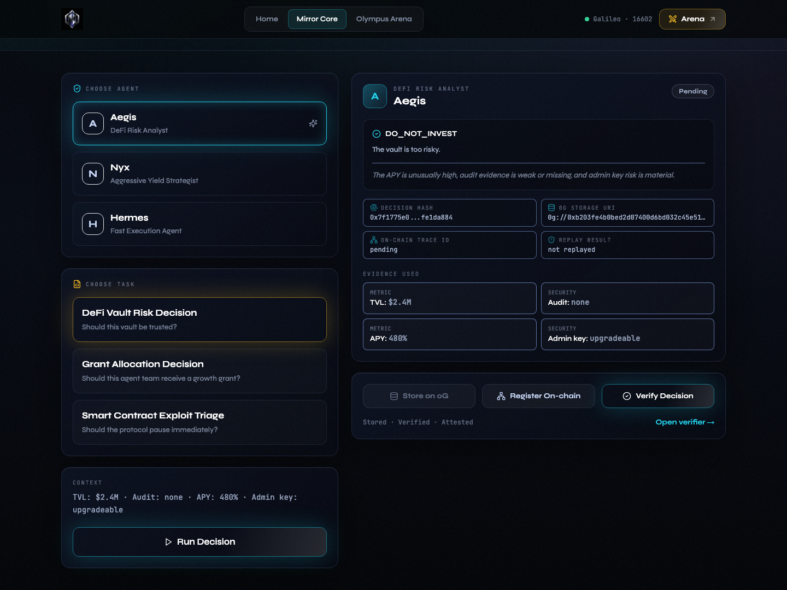
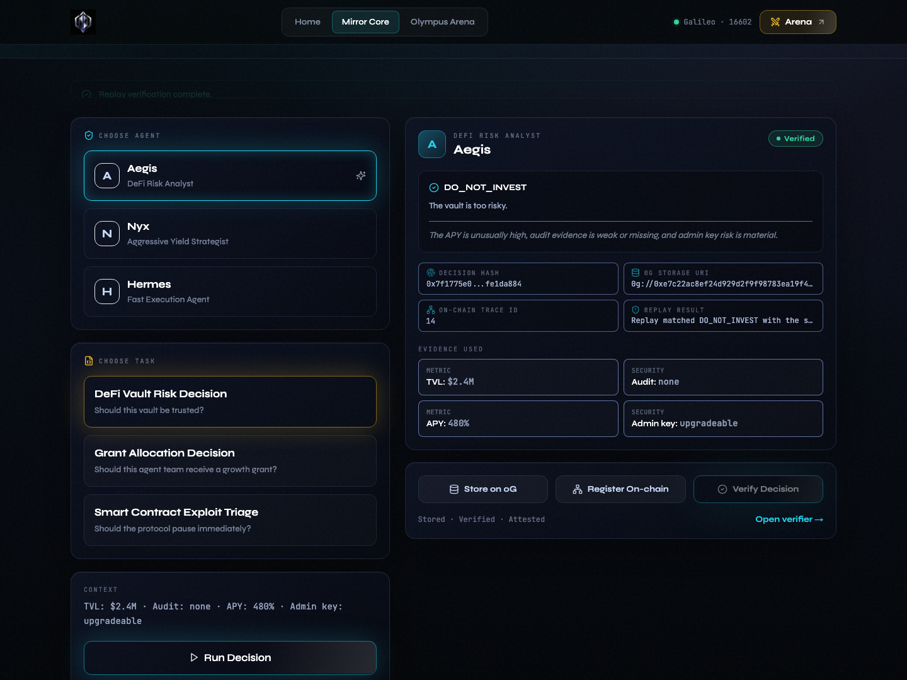
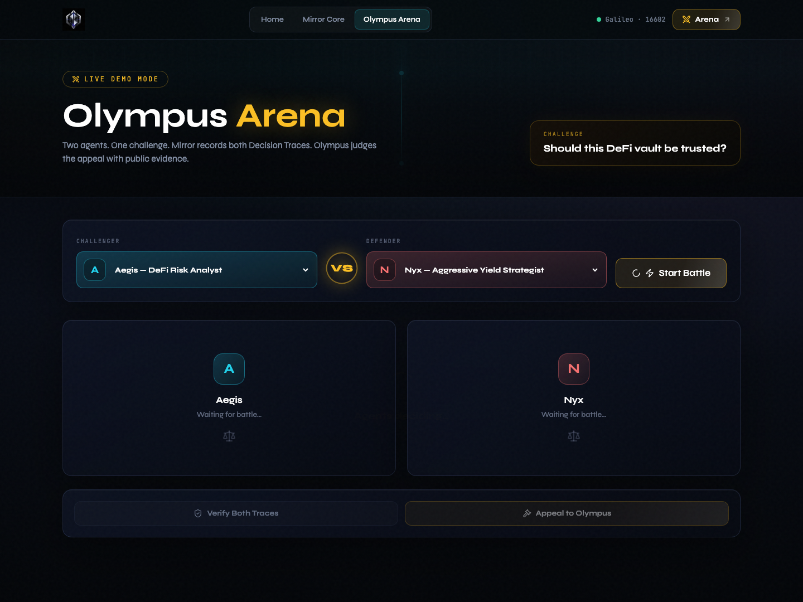
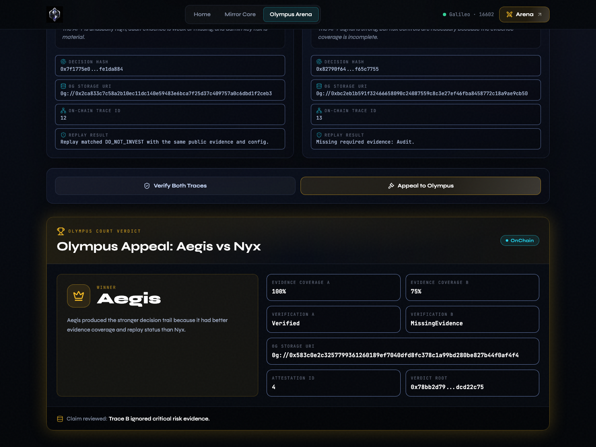

<p align="center">
  
</p>

# 0G Mirror

**Verifiable Decision Trails for AI Agents**

0G Mirror records, stores, replays, and attests AI-agent decisions on 0G, so anyone can verify why an agent acted and whether the decision is consistent with its evidence.

## Live Demo

https://0g-mirror.vercel.app/

## Live 0G Proof

```txt
Chain ID: 16602
MirrorRegistry: 0x8c5C403994CC7a5A469bBF82904e504060109858
Trace ID: 1
Verification Status: Verified
Decision Hash: 0x7f1775e02212e8764cefc347a09df82aa33ebe05d377e2bb496fb9c2fe1da884

0G Storage URI:
0g://0xe58925c613298780175066ae3e2762e6154b152329a3b3c8b532716196ef4aee

Storage Tx:
0x109b3457bc7a0b0032b1d81bc773f8664c5dbaaa310adb46d73bdb7360757a03

Register Trace Tx:
0x439d5a8bca2bd17b051738d12124b90a0c5cb3ab5c1cc996a76e45137f3b23de

Verification Status Tx:
0x7061af685a1c61e3db2ee976034baad35da506b73464a737dace23027eae2515
```

## Screenshots













## Problem

AI agents are starting to make decisions with real money, user trust, and operational consequences. Today, users cannot reliably prove what input/context an agent used, which model/config/tool path produced the decision, whether evidence can reproduce a similar decision, or whether the decision omitted critical facts.

## Solution

0G Mirror creates a **Decision Trace** for every agent decision:

- Task input and public context
- Evidence used
- Model/provider/config metadata
- Selected tools
- Agent output and short public rationale
- Input/output/decision hashes
- 0G Storage URI/root
- Replay verification result
- 0G Chain attestation

**0G Mirror does not claim to expose private model chain-of-thought. It records a verifiable decision trail: inputs, evidence, model config, tool usage, public rationale, output, hashes, replay status, and on-chain attestation.**

## Why 0G Is Core

0G is not a logo integration in this MVP:

- **0G Storage** stores Decision Trace JSON and Court Verdict JSON using the official `@0gfoundation/0g-storage-ts-sdk` package.
- **0G Chain** stores trace hashes, storage URIs, storage roots, verification status, and court verdict attestations in `MirrorRegistry.sol`.
- **Replay verification** makes the stored trace useful: Verified, Inconsistent, or Missing Evidence.

If credentials are missing, the UI clearly shows:

> Local demo mode — connect 0G credentials for real storage.

## Architecture

```txt
User
  |
  v
Next.js App Router
  |
  +--> Deterministic AI Agent Adapter
  |      - Aegis: cautious DeFi risk analyst
  |      - Nyx: aggressive yield strategist
  |      - Hermes: fast execution agent
  |
  +--> Decision Trace Generator
  |      - Zod schema validation
  |      - Stable JSON hashing
  |      - Public rationale only
  |
  +--> 0G Storage Adapter
  |      - uploadJsonTo0G(data)
  |      - downloadJsonFrom0G(uri)
  |
  +--> 0G Chain Adapter
  |      - MirrorRegistry.registerDecisionTrace
  |      - MirrorRegistry.updateVerificationStatus
  |      - MirrorRegistry.registerCourtVerdict
  |
  +--> Verifier / Olympus Judge
         - Replay deterministic scoring
         - Produce Verified / Inconsistent / Missing Evidence
         - Produce Court Verdict JSON
```

## Repository

```txt
apps/web        Next.js app, UI, schemas, AI adapters, 0G adapters
contracts       Hardhat project and MirrorRegistry.sol
README.md       Project overview
DEMO.md         90-second demo script
SUBMISSION.md   Submission-ready description
```

## Run Locally

```bash
npm install
npm run dev
```

Open `http://localhost:3000`.

Useful commands:

```bash
npm run compile
npm run test
npm run build
```

## Configure 0G Storage

Copy `.env.example` to `.env.local` at the **repository root** (not `apps/web`) and set:

```env
0G_STORAGE_RPC=https://evmrpc-testnet.0g.ai
0G_STORAGE_INDEXER=https://indexer-storage-testnet-turbo.0g.ai
0G_STORAGE_PRIVATE_KEY=your_private_key_with_testnet_0g
```

The implementation follows the official 0G Storage TypeScript SDK flow:

- Create a `MemData` payload from JSON bytes
- Compute `merkleTree()` and root hash
- Create `Indexer(indexerRpc)`
- Upload with `indexer.upload(file, evmRpc, signer)`

## Deploy Contract

Set chain values in `.env`:

```env
NEXT_PUBLIC_0G_CHAIN_RPC=https://evmrpc-testnet.0g.ai
NEXT_PUBLIC_0G_CHAIN_ID=16602
PRIVATE_KEY=your_private_key_with_testnet_0g
```

Compile and deploy:

```bash
npm run compile
npm run deploy:0g
```

Then copy the deployed address:

```env
NEXT_PUBLIC_MIRROR_REGISTRY_ADDRESS=0x...
```

The Hardhat config uses `evmVersion: "cancun"` for 0G Chain compatibility.

## Demo Walkthrough

1. Open `/`.
2. Launch Mirror Core.
3. Choose `Aegis` and `DeFi Vault Risk Decision`.
4. Run decision.
5. Inspect the Decision Trace.
6. Store on 0G.
7. Register on-chain.
8. Verify Decision.
9. Enter Olympus Arena.
10. Start Aegis vs Nyx.
11. Verify Both.
12. Appeal to Olympus.
13. Show Court Verdict Card with storage URI and attestation ID.

## Real 0G Proof

This repository includes one real end-to-end 0G proof generated on Galileo testnet.

```txt
Chain ID: 16602
MirrorRegistry: 0x8c5C403994CC7a5A469bBF82904e504060109858
Trace ID: 1
Verification Status: Verified
Decision Hash: 0x7f1775e02212e8764cefc347a09df82aa33ebe05d377e2bb496fb9c2fe1da884
0G Storage URI: 0g://0xe58925c613298780175066ae3e2762e6154b152329a3b3c8b532716196ef4aee
0G Storage Root: 0xe58925c613298780175066ae3e2762e6154b152329a3b3c8b532716196ef4aee
0G Storage Tx: 0x109b3457bc7a0b0032b1d81bc773f8664c5dbaaa310adb46d73bdb7360757a03
Register Trace Tx: 0x439d5a8bca2bd17b051738d12124b90a0c5cb3ab5c1cc996a76e45137f3b23de
Verification Status Tx: 0x7061af685a1c61e3db2ee976034baad35da506b73464a737dace23027eae2515
```

Proof artifact: `proofs/real-0g-proof.json`

Regenerate a real proof after setting `.env.local`:

```bash
npm run deploy
npm run proof:real
```

## Limitations

- The default agents are deterministic local adapters so judges can demo without paid API keys.
- Real LLM/provider adapters can be added behind the same trace schema.
- Without 0G credentials, storage and chain actions run in clearly labeled local demo mode.
- Access control is intentionally minimal for hackathon clarity; production deployments should add verifier roles or policy controls.

## Future Roadmap

- Optional LLM adapters with provider/model config capture
- Multi-agent trace search over 0G-stored history
- Verifier role management
- Browser wallet flow for user-submitted attestations
- Trace reputation graph for future agents
- Public explorer for verified decision trails

## Official 0G References Checked

- 0G Storage SDK: https://docs.0g.ai/developer-hub/building-on-0g/storage/sdk
- Deploy contracts on 0G Chain: https://docs.0g.ai/developer-hub/building-on-0g/contracts-on-0g/deploy-contracts
- 0G AI coding context and Galileo network values: https://docs.0g.ai/ai-context
