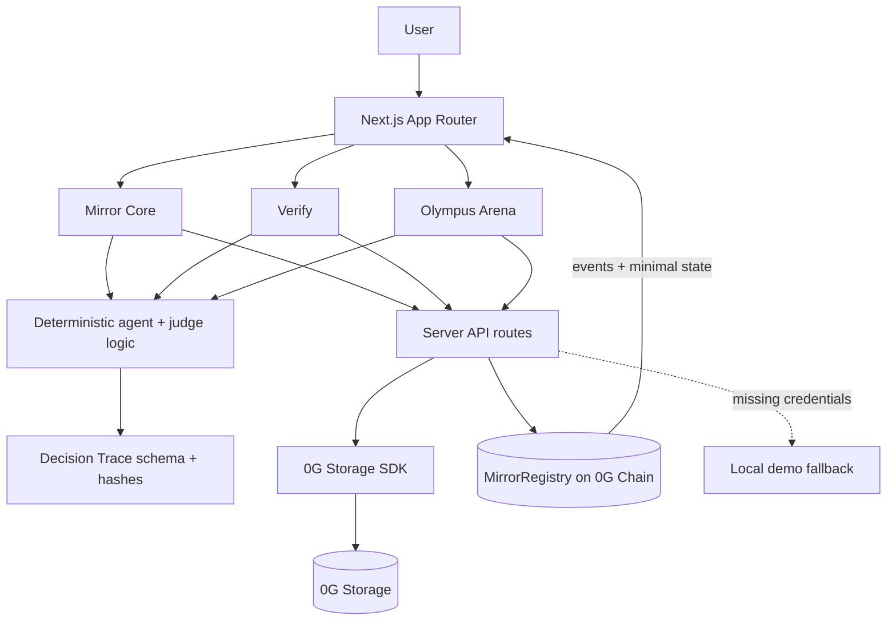
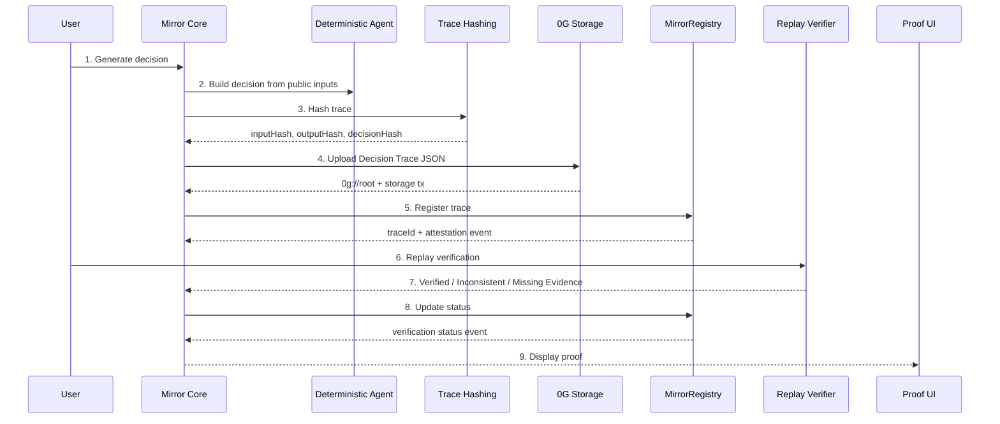

# 0G Mirror Architecture

0G Mirror is a verifiable decision trail system for AI agents. The system records a Decision Trace, stores it on 0G Storage, replays the trace deterministically, and attests the result on 0G Chain through MirrorRegistry.

> 0G Mirror does not record private model chain-of-thought. It records a public verification package: input, context, evidence, model metadata, tool usage, public rationale, output, hashes, replay status, and attestation.

## 1. System Overview

The app is a Next.js + TypeScript monorepo with three primary user surfaces: Mirror Core, Verify, and Olympus Arena. Mirror Core creates and attests a single Decision Trace. Verify replays an existing trace. Olympus Arena is a showcase mode that compares two traces, runs a judge, and emits a Court Verdict.

The current MVP uses deterministic local agents and replay verification. When 0G credentials are present, the same flow writes to real 0G Storage and 0G Chain. When credentials are missing, the app falls back to clearly labeled local demo mode.

Relevant code paths:

- [apps/web/lib/ai/agent.ts](../apps/web/lib/ai/agent.ts)
- [apps/web/lib/ai/verifier.ts](../apps/web/lib/ai/verifier.ts)
- [apps/web/lib/ai/judge.ts](../apps/web/lib/ai/judge.ts)
- [apps/web/lib/0g/storage.ts](../apps/web/lib/0g/storage.ts)
- [apps/web/lib/0g/chain.ts](../apps/web/lib/0g/chain.ts)
- [contracts/contracts/MirrorRegistry.sol](../contracts/contracts/MirrorRegistry.sol)

## Current MVP vs Future Work

| Layer | Current MVP | Future Work |
| --- | --- | --- |
| Decision generation | Deterministic local agents | Optional external model/provider adapters |
| Verification | Deterministic replay verification | 0G Compute-backed verifiable execution |
| Storage | Real 0G Storage uploads when configured | Larger trace indexing and search |
| Chain | Real MirrorRegistry attestations on 0G Chain | Role-based verifier registry |
| Demo | Olympus Arena showcase | Public trace explorer and multi-agent graph |

## 2. High-level architecture diagram

## 3. Data flow diagram

## 4. Decision Trace lifecycle

1. Generate decision. A deterministic agent chooses a label, output, and public rationale from public evidence.
2. Build trace. The app packages agent identity, task context, model metadata, evidence, hashes, and replay status into a versioned Decision Trace.
3. Hash trace. The trace is normalized and hashed into input, output, and decision hashes.
4. Upload trace. The JSON payload is uploaded to 0G Storage through the SDK when credentials are present, or saved locally in demo mode.
5. Register trace. MirrorRegistry records the decision hash, storage URI, and storage root on 0G Chain.
6. Replay verification. The verifier recomputes the expected outcome from the public evidence and checks for missing evidence.
7. Update status. The on-chain trace status is updated to Verified, Inconsistent, or Missing Evidence.
8. Display proof. The UI renders the trace card, storage URI, transaction links, and verification result.

## 5. Storage layer

The storage layer lives in [apps/web/lib/0g/storage.ts](../apps/web/lib/0g/storage.ts) and is exposed through [apps/web/app/api/storage/upload/route.ts](../apps/web/app/api/storage/upload/route.ts) and [apps/web/app/api/storage/download/route.ts](../apps/web/app/api/storage/download/route.ts).

It uses the official 0G Storage SDK (`Indexer` and `MemData`) to serialize JSON bytes, compute a Merkle tree, derive a stable root hash, and upload the payload. The resulting `0g://<root>` URI is content-addressed by the same root that appears in the proof artifact.

Upload flow:

- normalize and serialize the Decision Trace JSON
- compute the Merkle root with `MemData.merkleTree()`
- upload through the 0G indexer with a storage signer
- return `uri`, `root`, and `txHash`

Download and verification flow:

- parse a `0g://` URI or raw root hash
- download the JSON to a temp file through the SDK
- read and parse the downloaded payload
- compare the payload contents and hashes against the expected trace

When credentials are missing, the API returns a `MISSING_CONFIG` response and the app switches to clearly labeled local demo mode. That fallback keeps the demo usable without pretending live storage exists.

## 6. Chain layer

The chain layer lives in [apps/web/lib/0g/chain.ts](../apps/web/lib/0g/chain.ts) and targets the Solidity contract in [contracts/contracts/MirrorRegistry.sol](../contracts/contracts/MirrorRegistry.sol).

MirrorRegistry exposes three core calls:

- `registerDecisionTrace(bytes32 decisionHash, string traceURI, bytes32 traceRoot)`
- `updateVerificationStatus(uint256 traceId, VerificationStatus status)`
- `registerCourtVerdict(uint256 traceIdA, uint256 traceIdB, string verdictURI, bytes32 verdictRoot, uint256 winningTraceId)`

The chain adapter uses these values from `.env.local`:

- `NEXT_PUBLIC_MIRROR_REGISTRY_ADDRESS`
- `NEXT_PUBLIC_0G_CHAIN_RPC`
- `NEXT_PUBLIC_0G_CHAIN_ID`
- `PRIVATE_KEY`

Assumptions:

- the RPC endpoint is reachable
- the registry address is deployed on the selected chain
- the private key is funded for the target network
- the current proof uses chain ID 16602

Attestation is event-based. The contract emits `DecisionTraceRegistered`, `VerificationStatusUpdated`, and `CourtVerdictRegistered`, and the transaction hash becomes the proof of registration.

## 7. Replay verification layer

Replay verification lives in [apps/web/lib/ai/verifier.ts](../apps/web/lib/ai/verifier.ts). The verifier resolves the agent and task from the stored trace, checks required evidence by name, and recomputes the expected label from the public evidence.

Outputs:

- `Verified` when the replayed decision matches the recorded label
- `Inconsistent` when the replayed label differs from the recorded label
- `MissingEvidence` when required evidence is absent

The replay logic is explainable because the scoring rules are deterministic, the evidence list is explicit, and the public rationale is stored alongside the decision. The verifier does not need hidden reasoning to justify the result.

## 8. Olympus Arena showcase layer

Olympus Arena is a showcase mode built on the same primitives as Mirror Core, not a separate system. The arena client in [apps/web/components/arena/ArenaClient.tsx](../apps/web/components/arena/ArenaClient.tsx) runs two deterministic agents on the same challenge, replays both traces, then sends the pair to the Olympus judge in [apps/web/lib/ai/judge.ts](../apps/web/lib/ai/judge.ts).

The showcase flow is:

- two agents compete on one decision prompt
- each agent produces a Decision Trace
- both traces are verified
- the judge compares evidence coverage and replay status
- the result becomes a Court Verdict artifact
- the verdict is stored and attested like any other proof object

The appeal path is intentionally legible. “Appeal to Olympus” is the demo surface for turning a contested agent outcome into a public verdict card.

## 9. Smart contract architecture

`MirrorRegistry` keeps the on-chain state minimal. It stores the creator, decision hash, trace URI, trace root, creation timestamp, and verification status for each trace. For verdicts, it stores the two trace IDs, verdict URI, verdict root, winning trace ID, and timestamp.

What is stored on chain:

- trace count and verdict count
- minimal trace records
- minimal verdict records
- status transitions
- emitted attestation events

What is not stored on chain:

- full Decision Trace JSON
- public evidence payloads
- model output text beyond what the app chooses to display off chain
- hidden reasoning
- large verdict payloads

This split keeps the contract auditable while pushing large artifacts to 0G Storage.

## 10. API routes

The web app exposes five POST routes in [apps/web/app/api](../apps/web/app/api):

| Route | Purpose |
| --- | --- |
| [storage/upload](../apps/web/app/api/storage/upload/route.ts) | Uploads JSON to 0G Storage and returns the URI, root, and optional tx hash. |
| [storage/download](../apps/web/app/api/storage/download/route.ts) | Downloads a stored JSON artifact from a 0g URI. |
| [chain/register-trace](../apps/web/app/api/chain/register-trace/route.ts) | Registers a Decision Trace on 0G Chain. |
| [chain/update-status](../apps/web/app/api/chain/update-status/route.ts) | Updates the on-chain verification status for a trace. |
| [chain/register-verdict](../apps/web/app/api/chain/register-verdict/route.ts) | Registers a Court Verdict on 0G Chain. |

Each route returns JSON and maps missing credentials to a `MISSING_CONFIG` response so the UI can fall back cleanly.

## 11. Data schemas

The schemas live in [apps/web/lib/schemas/decision-trace.ts](../apps/web/lib/schemas/decision-trace.ts) and [apps/web/lib/schemas/court-verdict.ts](../apps/web/lib/schemas/court-verdict.ts).

Decision Trace schema fields and intent:

- `schema`: version lock for deterministic compatibility
- `traceId`: unique trace identifier
- `agent`, `task`, `model`: who decided, on what, and under which settings
- `toolsUsed`: public tool surface for replay context
- `decision`: label, output, and public rationale
- `evidence`: the public inputs the replay logic can inspect
- `hashes`: stable content hashes for trace integrity
- `verification`: replay outcome and explanation
- `storage`: 0G or local artifact location
- `attestation`: on-chain trace reference
- `timestamps`: provenance and audit timing

Court Verdict schema fields and intent:

- `schema`: version lock for verdict compatibility
- `caseTitle`, `traceA`, `traceB`, `claim`: what was judged
- `judge`: the named decision surface
- `verdict`: winner, summary, reason codes, evidence coverage, and verification status
- `hashes.verdictRoot`: stable hash of the verdict artifact
- `storage`, `attestation`: where the verdict lives and how it was registered
- `timestamps`: when the verdict was created

Schema versioning matters because traces and verdicts are replay artifacts. A versioned schema keeps old proofs readable even as the product evolves.

## 12. Security model

Trusted:

- the public evidence included in a trace
- the deterministic replay code in the repository
- the deployed `MirrorRegistry` contract when the network and credentials are configured
- the 0G Storage upload/download path when credentials are present

Verified:

- content hashes
- storage roots and URIs
- on-chain registration transactions
- replay results

Deterministic:

- agent scoring
- trace hashing
- verdict hashing
- replay classification

Not guaranteed:

- private chain-of-thought
- external truth beyond the submitted public evidence
- full production-grade access control
- verifiable execution beyond the current deterministic replay model

Fallback local mode:

- used only when 0G credentials are missing
- keeps the UI and demo flow functional
- is clearly labeled as local, not live 0G infrastructure

## Verification Boundaries

| Category | Meaning |
| --- | --- |
| Verified | Trace hashes, storage roots, registered URI/hash, replay status, transaction events |
| Trusted | Public evidence supplied to the trace, deterministic verifier code, configured RPC/storage endpoints |
| Not claimed | Private chain-of-thought, external truth beyond submitted evidence, full production oracle security, current fully decentralized compute |

## 13. Trust assumptions

- Public evidence is honest and complete enough for replay.
- Replay logic is deterministic.
- Contract and storage endpoints are reachable when credentials exist.
- Local demo mode is only a fallback.

## 14. Limitations

- The current MVP uses deterministic local agents.
- The app does not expose private chain-of-thought.
- Access control is minimal.
- The current MVP is not a full production verifiable-compute platform yet.
- The current MVP uses deterministic replay verification and is designed to plug into 0G Compute for verifiable execution.
- Local demo fallback is necessary when credentials are missing.

## 15. Future architecture

The current MVP uses deterministic replay verification and is designed to plug into 0G Compute for verifiable execution.

Possible next steps:

- 0G Compute integration for verifiable execution
- browser wallet flow
- trace explorer
- multi-agent decision graph
- verifier roles
- stronger policy controls
