# 0G Mirror — Architecture

Verification infrastructure for AI-agent decisions on 0G.

---

## Judge TL;DR

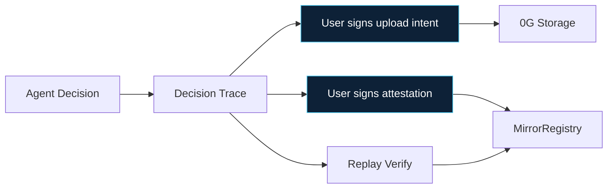

| | |
| --- | --- |
| **What** | Verification layer — not an agent runtime |
| **Stored** | Public rationale + evidence trail — **not** private chain-of-thought |
| **Storage** | User signs EIP-712 → operator uploads exact artifact server-side |
| **Chain** | User wallet signs all `MirrorRegistry` writes |
| **0G** | Storage = artifacts · Chain = compact proof — both load-bearing |
| **Compute** | 0G Compute = **future**. MVP = deterministic replay |
| **Arena** | Showcase mode — not a separate product |

---

## 1. System Overview

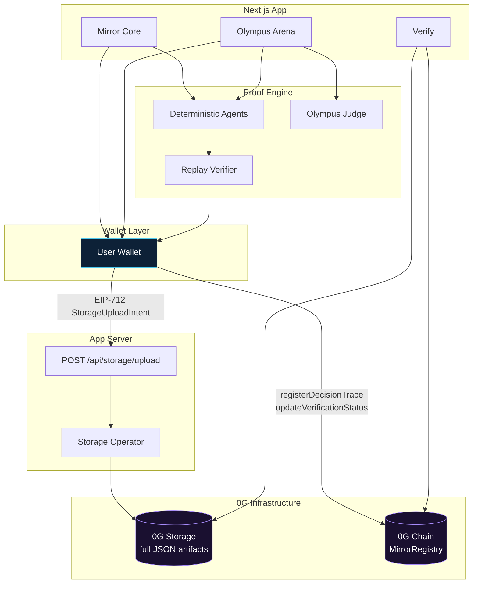

| Surface | Role |
| --- | --- |
| Mirror Core | Single Decision Trace → storage → chain → replay |
| Verify | Read trace by ID, inspect proof links |
| Olympus Arena | Two agents + Court Verdict on same pipeline |

---

## 2. End-to-End Proof Flow

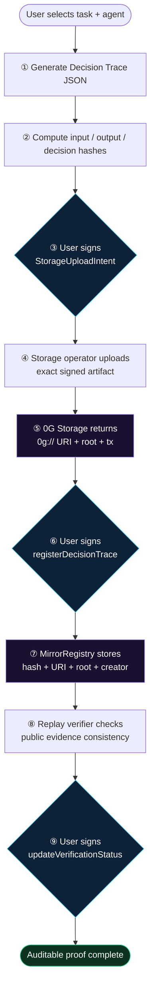

**Wallet-signed steps:** ③ ⑥ ⑨ — everything else is deterministic or operator-executed under user authorization.

---

## 3. Decision Trace Artifact

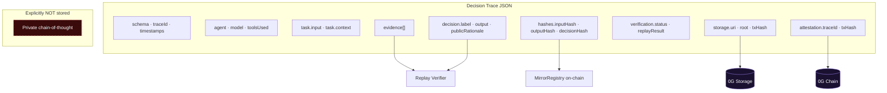

Schema: `0g-mirror/decision-trace/v1` · `apps/web/lib/schemas/decision-trace.ts`

---

## 4. Wallet-Authorized Storage Upload

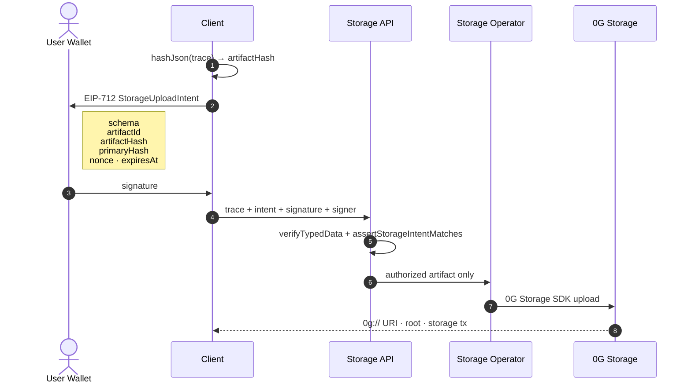

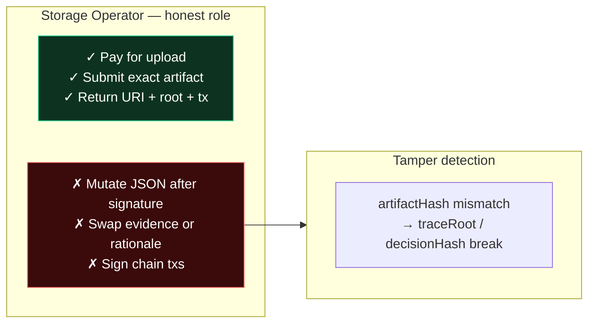

**Not a relayer.** Server-side execution for reliability; user authorization via wallet signature.  
Code: `storage-intent.ts` · `client-storage.ts` · `api/storage/upload/route.ts`

---

## 5. Wallet-Signed Chain Attestation

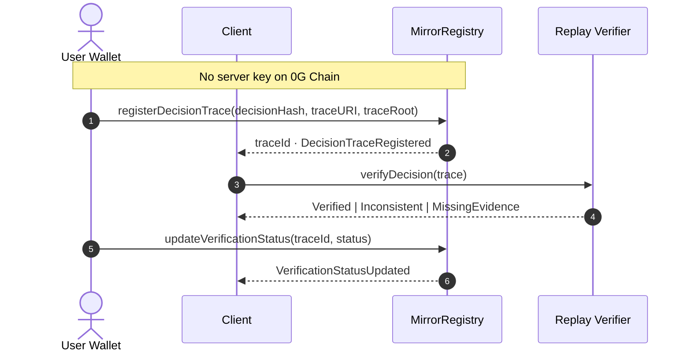

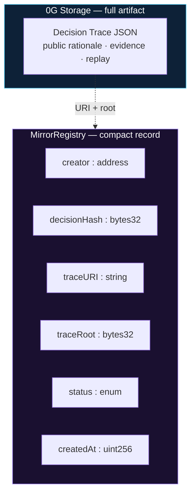

Contract: `contracts/contracts/MirrorRegistry.sol` · Galileo `0x8c5C403994CC7a5A469bBF82904e504060109858`

---

## 6. Trust Boundaries

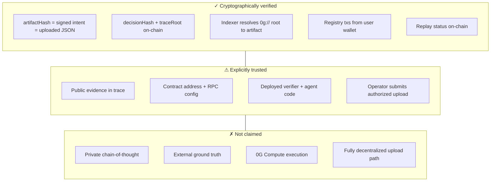

---

## 7. Replay Verification

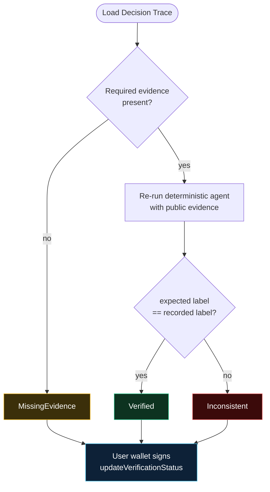

**MVP:** deterministic replay · **Future:** 0G Compute — not implemented, not claimed.  
Code: `apps/web/lib/ai/verifier.ts`

---

## 8. Olympus Arena (Showcase)

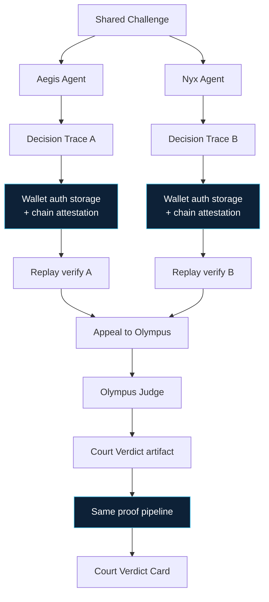

Showcase mode on the same infrastructure — not a separate product.  
Schema: `0g-mirror/court-verdict/v1`

---

## 9. 0G Data Split

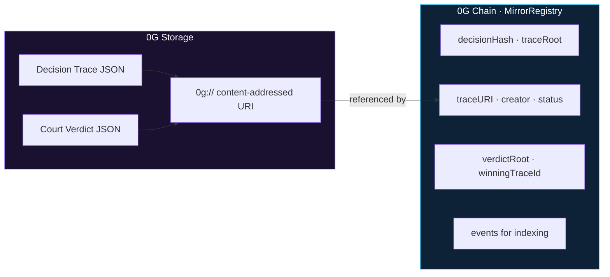

---

## 10. MVP vs Future

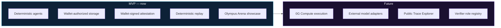

---

## Live Proof (Galileo · chainId 16602)

| | |
| --- | --- |
| MirrorRegistry | [`0x8c5C…09858`](https://chainscan-galileo.0g.ai/address/0x8c5C403994CC7a5A469bBF82904e504060109858) |
| Trace | `#1` · `Verified` |
| Decision Hash | `0x7f1775e02212e8764cefc347a09df82aa33ebe05d377e2bb496fb9c2fe1da884` |
| Artifact | [`0g://…ef4aee`](https://indexer-storage-testnet-turbo.0g.ai/file?root=0xe58925c613298780175066ae3e2762e6154b152329a3b3c8b532716196ef4aee) |
| Txs | [Storage](https://chainscan-galileo.0g.ai/tx/0x109b3457bc7a0b0032b1d81bc773f8664c5dbaaa310adb46d73bdb7360757a03) · [Register](https://chainscan-galileo.0g.ai/tx/0x439d5a8bca2bd17b051738d12124b90a0c5cb3ab5c1c996a76e45137f3b23de) · [Verify](https://chainscan-galileo.0g.ai/tx/0x7061af685a1c61e3db2ee976034baad35da506b73464a737dace23027eae2515) |

Files: `proofs/real-0g-proof.json` · `proofs/downloaded-real-trace.json`
